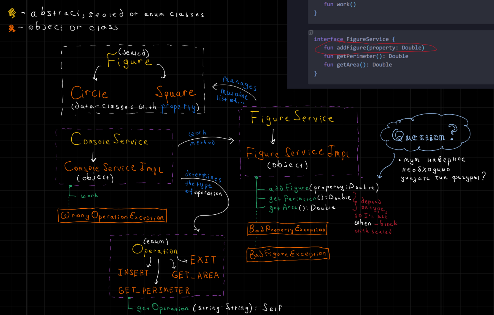

# Моя реализация

Структура программы выглядит так:



Запустить можно при помощи команды `./gradlew run`

# Задание ко второй лекции

Реализуйте программу, которая позволяет пользователю через консоль работать с набором фигур.
Самих фигур может быть 2 вида: `Circle` и `Square`, у них есть общий параметр `property`, который задает радиус и длину стороны соответственно.

Они должны наследоваться от `Figure`.

- При этом у родительского класса должно быть ограничено наследование так,
чтобы можно было наследоваться только из того же пакета:

- (чтобы компилятор мог явно _"увидеть всех наследников"_ и вы могли работать с `when` без обязательной ветки `else`). 

При этом при инициализации фигуры в консоль должно выводиться строка вида `<название фигуры> (property=<какое-то значение>)`, например:
`Square(property=6)`
Подумайте, какой тип класса тут стоит использовать, который может приводить экземпляр к строке такого вида _"из коробки"_.
Пользователю должно быть предоставлена возможность:

1) Добавления фигуры в набор.
2) Получение площади всех фигур из набора.
3) Получение периметра всех фигур из набора.

   Для этого создайте 2 сервиса-интерфейса: `ConsoleService` и `FigureService`, 
   а также 2 их реализации, объекты которых должны создаваться только единожды: `ConsoleServiceImpl` и `FigureServiceImpl`.
   Сами интерфейсы должны выглядеть так:
   ```kt
   interface ConsoleService {
      fun work()
   }
   ```

   ```kt
   interface FigureService {
      fun addFigure(property: Double)
      fun getPerimeter(): Double
      fun getArea(): Double
   }
   ```
   
При этом в их реализациях должны быть сокрыты:

1) У `FigureServiceImpl` как раз набор фигур, с которым мы будем работать. 
   Доступ к нему должен осуществляться только через методы, которые есть в соответствующем интерфейсе.

2) У `ConsoleServiceImpl` отдельные методы для каждой из предоставляемых пользователю функций, то есть метод work должен иметь примерно такой вид:
   ```kt
   override fun work() {
      while(true) {
         println("Введите тип операции, которую хотите исполнить:\n1) добавить фигуру\n2) получить площадь всех фигур\n3) получить периметр всех фигур\n4) завершить выполнение")
         val operation = getOperation(readln())
         when (operation) {
            Operation.INSERT -> addFigure()
            Operation.GET_AREA -> getArea()
            Operation.GET_PERIMETER -> getPerimiter()
            Operation.EXIT -> break
         }
      }
   }
   ```
   Также, как видно из кода выше, необходимо создать класс-перечисление `Operation`, который будет поддерживать необходимые операции.
  
   Соответственно нужно написать определитель операции по введенному значению `getOperation`.

   Также вы должны создать 2 собственных исключения:

   1) `BadPropertyException`, которое должно вызываться в `FigureServiceImpl` в случае, если введенная пользователем `property <= 0` либо это `NaN`.
   2) `WrongOperationTypeException`, которое должно вызываться в случае, если придет неизвестный тип операции
   
      Их надо обрабатывать в `ConsoleServiceImpl.work()` - т.е. код относительно примера выше несколько изменится и выводить соответствующие сообщения:
      - `"Введено неверное значение параметра property: ${плохое значение}"`.
      - `"Введен неизвестный тип операции: ${плохой тип операции}"`.
      
      В качестве набор фигур используйте `MutableList<Figure>`.
   
      Его интерфейс "google"-ится (изучается) своими силами в IDE.